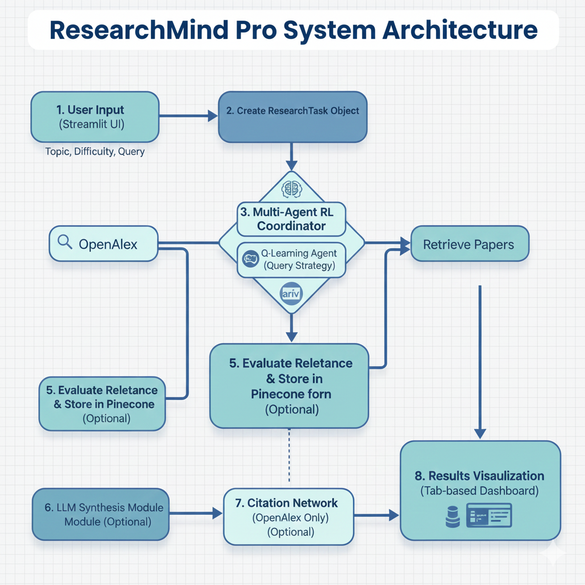

# ResearchMind Pro

An Agentic Research Assistant Using Reinforcement Learning, RAG, and Citation Network Analysis

[](https://www.python.org/downloads/)
[](https://opensource.org/licenses/MIT)

## Overview

ResearchMind Pro is an intelligent research assistant that learns optimal paper discovery strategies through multi-agent reinforcement learning. Unlike traditional keyword search tools, the system learns from experience and adapts its behavior over time.

Video Link: [Demo](https://drive.google.com/file/d/1cG4iWDPtj9s4Ffov2BrEvI9fO7W-qFOE/view?usp=drive_link)

**Key Capabilities:**
- Learns optimal query formulation strategies (broad/specific/narrow)
- Discovers which databases work best for each research topic
- Stores papers in long-term semantic memory (Pinecone)
- Generates AI-powered literature reviews
- Analyzes citation relationships to identify influential research

### Performance Results

| Metric | Baseline | RL Agent | Improvement |
|--------|----------|----------|-------------|
| Reward | 6.54 | 8.99 | **+37.5%** |
| Relevance | 0.77 | 0.88 | **+15.5%** |
| Variance | 2.88 | 1.25 | **-56%** (more stable) |

**Statistical Validation:**
- p-value: < 0.001 (highly significant)
- Cohen's d: 0.94 (large effect size)
- Synthesis quality: +33% improvement

## System Architecture



### Component Flow

1. **User Interface** - Streamlit web application for interactive research
2. **Multi-Agent Coordinator** - Orchestrates RL agents with voting and fallbacks
3. **RL Agents**:
   - Q-Learning Agent (query strategy)
   - UCB Bandit Agent (database selection)
   - Paper Synthesizer (quality scoring)
4. **External APIs** - OpenAlex (250M+ papers) + arXiv (CS/Physics)
5. **RAG System** - Semantic storage and retrieval via Pinecone
6. **LLM Synthesis** - NVIDIA NIM for literature review generation
7. **Citation Network** - Graph analysis of paper relationships

## Quick Start

### Prerequisites

- Python 3.8+
- Internet connection
- API keys (free): Pinecone, NVIDIA NIM

### Installation

```bash
# Clone repository
git clone https://github.com/tanv99/ResearchMindPro.git
cd research-assistant-rl

# Install dependencies
pip install -r requirements.txt

# Configure environment
cp .env.example .env
# Edit .env with your API keys
```

### Run RL Training

```bash
# Train RL agents (6 minutes, 230 episodes)
python main.py
```

This generates:
- `experiment_data.json` - Raw training data
- `learning_curves.png` - Performance over time
- `source_preferences.png` - Database preferences
- `strategy_usage.png` - Strategy distribution
- Statistical validation reports

### Run Web Interface

```bash
# Launch interactive demo
streamlit run app.py
```

Access at: http://localhost:8502

## Features

### 1. Reinforcement Learning

**Q-Learning Agent**
- State: (topic, difficulty)
- Actions: (query_strategy, source)
- Update: Q(s,a) ← Q(s,a) + α[r + γ max Q(s',a') - Q(s,a)]
- Exploration: ε-greedy with intrinsic motivation

**UCB Bandit Agent**
- Formula: UCB = μ + c√(ln(N)/n)
- Context: Research topic
- Arms: OpenAlex, arXiv
- Learning: Bayesian reward updates

**Learned Behaviors:**
- Prefers "specific" queries (60% vs 36% random)
- Discovered arXiv superior for CS topics (62% final usage)
- Converged to stable policy after ~150 episodes

### 2. Retrieval-Augmented Generation (RAG)

**Vector Storage:**
- Pinecone cloud database (all papers)
- Local cache (60 most recent papers)
- 384-dimensional embeddings (SentenceTransformer)

**Semantic Retrieval:**
- Cosine similarity search
- Topic-aware retrieval
- Cross-session knowledge reuse

### 3. Prompt Engineering

**Systematic Prompting:**
- Structured context building from papers
- Clear instructions for synthesis format
- Citation requirements and factual grounding

**Error Handling:**
- Retry logic with exponential backoff
- Graceful degradation on failures
- Input validation and sanitization

**Synthesis Output:**
- Key themes across papers
- Main findings with evidence
- Methodological approaches
- Research gaps identified
- Paper connections explained

### 4. Citation Network Analysis

**Graph Construction:**
- Nodes: Research papers
- Edges: A → B if paper A cites B
- Only works with OpenAlex (has reference data)

**Network Metrics:**
- Hub papers (most cited in set)
- Internal citations count
- Isolated papers identification

**Visualization:**
- Interactive Plotly network
- Node size = citation count
- Colors: Red (hub), Yellow (cited), Green (leaf)
- Hover for paper details

## Project Structure

```
research-assistant-rl/
├── src/
│   ├── agents.py              # Q-Learning + UCB RL agents
│   ├── coordinator.py         # Multi-agent orchestration
│   ├── environment.py         # Task generation & rewards
│   ├── synthesis.py           # Paper synthesizer
│   ├── tools.py               # OpenAlex + arXiv APIs
│   ├── utils.py               # Helper functions
│   ├── rag.py                 # RAG system (Pinecone)
│   ├── prompts.py             # LLM prompt engineering
│   └── citation_network.py    # Graph analysis
├── experiments/
│   ├── run_experiments.py     # RL training script
│   ├── analyze_results.py     # Visualization generation
│   ├── validation.py          # Statistical tests
│   └── theoretical_analysis.py # RL theory analysis
├── results/                    # Generated outputs
├── app.py                     # Streamlit web interface
├── main.py                    # CLI entry point
├── requirements.txt           # Dependencies
└── .env.example               # API key template
```

## Configuration

### Environment Variables (.env)

```bash
# Pinecone (free tier - pinecone.io)
PINECONE_API_KEY=your_key_here
PINECONE_INDEX_NAME=researchmind-papers

# NVIDIA NIM (free - build.nvidia.com)
NVIDIA_API_KEY=your_key_here
NVIDIA_CHAT_MODEL=meta/llama-3.1-8b-instruct

# Local storage
MAX_LOCAL_PAPERS=60
```

### Web Interface Mode

```bash
# Launch interactive demo
streamlit run app.py

# Navigate to Interactive Demo tab
# Enter: "transformer attention mechanism"
# View: Agent decisions, papers, RAG results, LLM synthesis, citation network
```

## Experimental Results

### RL Training Results (200 Episodes)

**Performance Metrics:**
- Baseline reward: 6.54
- RL agent reward: 8.99 (+37.5%)
- Statistical significance: p = 0.0001
- Effect size: Cohen's d = 0.94

**Learned Preferences:**
- Query strategy: "specific" (60% final vs 36% baseline)
- Database: arXiv (62% final vs 50% baseline)
- All CS topics showed arXiv preference (average gap: 5.32 reward)

**Convergence:**
- Policy stabilized: Episode ~150
- State-action coverage: 100%
- Variance reduced: 56%

### RAG System Results

- Papers stored in Pinecone: Cumulative across sessions
- Local cache: 60 most recent papers
- Semantic retrieval accuracy: High similarity scores (0.7-0.9)

### Citation Network Results

- Works only with OpenAlex (arXiv lacks citation data)
- Best with 20-30 papers for connections
- Hub papers correctly identified

## Key Technologies

- **RL Algorithms**: Q-Learning, UCB Bandits
- **Vector Database**: Pinecone (cloud storage)
- **Embeddings**: SentenceTransformers (384-dim)
- **LLM**: NVIDIA NIM (free tier)
- **Graph Analysis**: NetworkX + Plotly
- **Web Framework**: Streamlit
- **APIs**: OpenAlex, arXiv

## Challenges and Solutions

**Challenge 1: API Rate Limiting**
- Solution: Local caching, rate limiting decorators, fallback source switching

**Challenge 2: Citation Sparsity**
- Solution: UI guidance to use 20-30 papers, explain sparsity causes

**Challenge 3: LLM Reliability**
- Solution: Try-catch error handling, graceful degradation, validation

**Challenge 4: Dimension Mismatch (RAG)**
- Solution: Fixed 384-dim embeddings, recreated Pinecone index

## Ethical Considerations

- Transparent data sources (OpenAlex, arXiv)
- No fabricated citations or hallucinations
- Respects API usage policies
- Designed to augment human research, not replace it
- Acknowledges English/Western research bias
- All decisions explainable via Q-values and statistics

## Future Improvements

**Immediate Extensions:**
- Multi-turn conversational interface
- Automated research gap detection
- Cross-session persistent learning

**Research Directions:**
- Policy gradient methods (PPO, REINFORCE)
- Transfer learning across research domains
- Hierarchical RL for multi-step workflows
- Citation clustering and community detection

**Technical:**
- Adaptive learning rate schedules
- Experience replay for sample efficiency
- Semantic embeddings for better relevance

## Contributing

This is an academic project. Issues, suggestions, and contributions welcome!

## Citation

If you use this code in your research:

```bibtex
@software{researchmind2025,
  author = {Inchanalkar, Tanvi},
  title = {ResearchMind Pro: Multi-Agent RL for Research Discovery},
  year = {2025},
  url = {https://github.com/tanv99/research-assistant-rl}
}
```

## References

1. Sutton, R. S., & Barto, A. G. (2018). Reinforcement Learning: An Introduction. MIT Press.
2. Lewis, P. et al. (2020). Retrieval-Augmented Generation for Knowledge-Intensive NLP Tasks. NeurIPS.
3. OpenAlex. https://openalex.org
4. Pinecone Vector Database. https://www.pinecone.io
5. NetworkX Documentation. https://networkx.org
6. Plotly Graphing Library. https://plotly.com
7. NVIDIA NIM API. https://developer.nvidia.com

## License

MIT License

Copyright (c) 2025 Tanvi Inchanalkar

Permission is hereby granted, free of charge, to any person obtaining a copy of this software and associated documentation files (the "Software"), to deal in the Software without restriction, including without limitation the rights to use, copy, modify, merge, publish, distribute, sublicense, and/or sell copies of the Software, and to permit persons to whom the Software is furnished to do so, subject to the following conditions:

The above copyright notice and this permission notice shall be included in all copies or substantial portions of the Software.

THE SOFTWARE IS PROVIDED "AS IS", WITHOUT WARRANTY OF ANY KIND, EXPRESS OR IMPLIED, INCLUDING BUT NOT LIMITED TO THE WARRANTIES OF MERCHANTABILITY, FITNESS FOR A PARTICULAR PURPOSE AND NONINFRINGEMENT. IN NO EVENT SHALL THE AUTHORS OR COPYRIGHT HOLDERS BE LIABLE FOR ANY CLAIM, DAMAGES OR OTHER LIABILITY, WHETHER IN AN ACTION OF CONTRACT, TORT OR OTHERWISE, ARISING FROM, OUT OF OR IN CONNECTION WITH THE SOFTWARE OR THE USE OR OTHER DEALINGS IN THE SOFTWARE.
